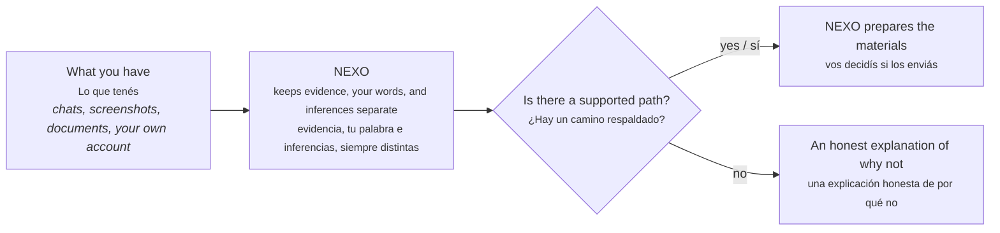

  

# NEXO

**Turn what happened to you into something you can actually show someone.**
**Convertí lo que te pasó en algo que de verdad podés mostrarle a alguien.**

[Live demo / Demo en vivo](https://nexo-web-sigma.vercel.app) ·
[Technical README](docs/TECHNICAL_README.md)

Read this in [English](#english) or [Español](#español).

---

## English

### What NEXO is

If someone is going through digital harassment, a privacy violation, or
another rights-affecting situation in their own life, the hard part is
rarely "what happened" — it's turning scattered screenshots, chats, and
memories into something a person, a platform, or an authority will actually
take seriously.

NEXO helps with that. You feed it what you have — messages, documents,
your own account of events — and it keeps every piece honestly labeled:
what you *have* (evidence), what you *said* (your own statement), and what
NEXO *concludes* (a bounded inference). It never blurs those together, and
it never invents a right you don't have. If the answer is "there isn't
enough here yet," it says exactly that, instead of pretending.

When there *is* a supported path forward, NEXO shows you why, citing the
actual law behind it — and can prepare the paperwork (a request, an
evidence package, an export) for you to send. **NEXO prepares. It never
files or sends anything on its own** — that line matters, and it's built
into the software, not just promised in writing.

### What it isn't

NEXO is not a lawyer, not legal advice, and not a chatbot that answers
questions from a general sense of the law. It is scoped, one jurisdiction
at a time, to real statutes it can cite — today, Argentina.

### Where things stand right now

Honestly, and without rounding up:

- **Argentina is real and working**, covering two situations: accessing,
  correcting, or deleting your personal data (Ley 25.326), and digital
  violence (Ley 27.736) — both backed by the actual captured legal text,
  not a paraphrase.
- The backend handles the full path: adding evidence, getting an
  evaluation, downloading a report, preparing and exporting materials.
  This was verified by actually running the test suite, not just reading
  the code — see the technical README for the specifics.
- The web app works end-to-end for that path, but today it only accepts
  pasted or uploaded plain text — attaching an email file, a PDF, or a
  screenshot to OCR is not built yet.
- A few things are prepared but not finished: a persistent personal
  deployment, an accessibility pass on the interface, and the United
  States bundle (planned once Argentina has been through a full
  adversarial security review).

None of that is hidden in fine print — the [technical README](docs/TECHNICAL_README.md)
lists it plainly, with the evidence behind each claim.

### Try it

The demo is at [nexo-web-sigma.vercel.app](https://nexo-web-sigma.vercel.app).
Note that the UI is live, but it needs a running backend (API + database)
behind it to actually create a case — see the technical README for what
that takes.

### For engineers

Architecture, contracts, current test status, and the honest list of
what's implemented versus what's still a gap: [`docs/TECHNICAL_README.md`](docs/TECHNICAL_README.md).

---

## Español

### Qué es NEXO

Si a alguien le está pasando una situación de violencia digital, una
violación de privacidad, u otra situación que afecta sus derechos, lo
difícil casi nunca es "qué pasó" — es convertir capturas de pantalla
sueltas, chats y recuerdos en algo que una persona, una plataforma o una
autoridad tome en serio.

NEXO ayuda con eso. Le das lo que tenés — mensajes, documentos, tu propio
relato de los hechos — y NEXO mantiene cada pieza etiquetada con
honestidad: lo que *tenés* (evidencia), lo que *dijiste* (tu declaración),
y lo que NEXO *concluye* (una inferencia acotada). Nunca mezcla esas
categorías, y nunca inventa un derecho que no tenés. Si la respuesta es
"todavía no hay suficiente para esto", NEXO dice exactamente eso, en vez de
simular una respuesta.

Cuando sí hay un camino respaldado, NEXO te muestra por qué, citando la ley
real detrás — y puede preparar los materiales (un pedido, un paquete de
evidencia, una exportación) para que vos los envíes. **NEXO prepara. Nunca
presenta ni envía nada por su cuenta** — esa línea importa, y está
construida en el software, no solo prometida por escrito.

### Qué no es

NEXO no es un abogado, no es asesoramiento legal, y no es un chatbot que
contesta preguntas desde una noción general del derecho. Está acotado, una
jurisdicción a la vez, a estatutos reales que puede citar — hoy, Argentina.

### Dónde está parado ahora mismo

Con honestidad, y sin redondear para arriba:

- **Argentina está real y funcionando**, cubriendo dos situaciones: acceder,
  corregir o eliminar tus datos personales (Ley 25.326), y violencia
  digital (Ley 27.736) — ambas respaldadas por el texto legal realmente
  capturado, no una paráfrasis.
- El backend cubre el camino completo: agregar evidencia, obtener una
  evaluación, descargar un informe, preparar y exportar materiales. Esto
  se verificó corriendo de verdad la suite de tests, no solo leyendo el
  código — el readme técnico tiene el detalle.
- La web funciona de punta a punta para ese camino, pero hoy solo acepta
  texto pegado o subido — adjuntar un email, un PDF, o una captura para
  OCR todavía no está construido.
- Hay cosas preparadas pero no terminadas: un deployment personal
  persistente, una revisión de accesibilidad de la interfaz, y el bundle
  de Estados Unidos (planeado una vez que Argentina pase por una revisión
  de seguridad adversarial completa).

Nada de esto está escondido en letra chica — el [readme técnico](docs/TECHNICAL_README.md)
lo lista con claridad, con la evidencia detrás de cada afirmación.

### Probalo

La demo está en [nexo-web-sigma.vercel.app](https://nexo-web-sigma.vercel.app).
Ojo: la interfaz está viva, pero necesita un backend corriendo (API + base
de datos) detrás para poder crear un caso de verdad — el readme técnico
explica qué hace falta para eso.

### Para ingenieros

Arquitectura, contratos, estado real de los tests, y la lista honesta de
qué está implementado versus qué falta todavía:
[`docs/TECHNICAL_README.md`](docs/TECHNICAL_README.md).

---

## License / Licencia

Apache License 2.0. See / Ver [`LICENSE`](LICENSE).
