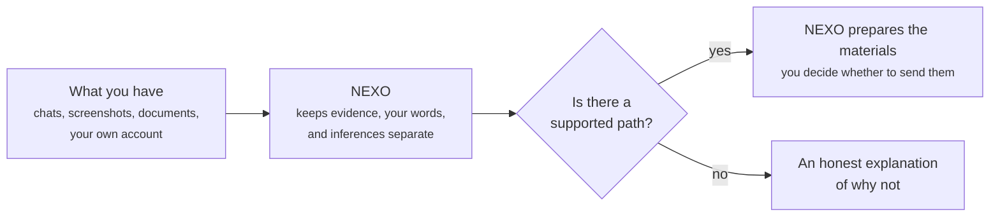

<p align="center">
  
</p>

# NEXO

**[English](README.md) · [Español](README_ES.md) · [Technical README](docs/TECHNICAL_README.md)**

**Turn what happened to you into something you can actually show someone.**

If someone is going through digital harassment, a privacy violation, or
another rights-affecting situation in their own life, the hard part is
rarely "what happened" — it's turning scattered screenshots, chats, and
memories into something a person, a platform, or an authority will actually
take seriously.

## What NEXO is

You feed NEXO what you have — messages, documents, your own account of
events — and it keeps every piece honestly labeled: what you *have*
(evidence), what you *said* (your own statement), and what NEXO *concludes*
(a bounded inference). It never blurs those together, and it never invents
a right you don't have. If the answer is "there isn't enough here yet," it
says exactly that, instead of pretending.

When there *is* a supported path forward, NEXO shows you why, citing the
actual law behind it — and can prepare the paperwork (a request, an
evidence package, an export) for you to send. **NEXO prepares. It never
files or sends anything on its own** — that line matters, and it's built
into the software, not just promised in writing.



## What it isn't

NEXO is not a lawyer, not legal advice, and not a chatbot that answers
questions from a general sense of the law. It is scoped, one jurisdiction
at a time, to real statutes it can cite — today, Argentina; the United
States is planned as a second, independent bundle.

|  | Typical online "know your rights" tool | NEXO |
|---|---|---|
| Evidence vs. your account vs. its own conclusion | Usually blurred into one narrative | Kept as three distinct, separately labeled kinds of claim |
| When nothing applies | Shows a generic result anyway, or goes blank | An honest negative result, with its precise cause, is a first-class outcome |
| Legal basis | Paraphrased or generic | Cites the actual captured statute text behind each claim |
| Filing the action | Sometimes implied or automated | Never — NEXO prepares materials, you send them |

## How it works, at a high level

A case is a graph: artifacts you provide, direct observations extracted
from them, your own assertions, and the facts and inferences derived from
those — each kept distinct. That graph is evaluated against a jurisdiction's
policy bundle (a versioned, source-cited set of legal rules), which decides
whether an action is available, and why. Everything that matters —
artifacts, exports, the policy bundle in force — can be hashed and checked
independently, so a result doesn't have to be taken on faith.

### You don't have to take NEXO's word for it

Every piece of evidence you add, every case you export, and the exact legal
bundle used to evaluate it gets a **SHA-256 fingerprint** — a unique digital
signature of those exact bytes. Change a single byte, and the fingerprint
changes with it. That's what makes it possible to:

- Prove that a document you exported from NEXO hasn't been altered since you
  got it.
- Let a lawyer, a platform, or a court check that fingerprint themselves,
  instead of taking NEXO's word for it.
- Verify all of that with a small, standalone tool that doesn't need NEXO's
  own server or database running — so what you exported stays checkable
  even without NEXO.

It's the same idea as a tamper-evident seal: not a promise that nothing can
go wrong, but a guarantee that if something did, it would show.

```text
nexo/
├── crates/
│   ├── nexo-core/                        # pure domain model: evidence graph, policy types, no I/O
│   ├── nexo-policy-ar/                   # Argentina: Ley 25.326 (personal data access) bundle
│   ├── nexo-policy-ar-digital-violence/  # Argentina: Ley 27.736 (digital violence) bundle
│   ├── nexo-policy-bridge/               # jurisdiction / bundle selection
│   ├── nexo-app/                         # transactions, PostgreSQL persistence, authorization
│   ├── nexo-api/                         # HTTP API — the only network-facing surface
│   ├── nexo-integrity/                   # hashing, canonical serialization, audit chain
│   ├── nexo-verifier/                    # standalone export verifier — no server, no database
│   ├── nexo-sandbox/                     # isolated evidence-extraction worker
│   ├── nexo-extraction/                  # extractor interface
│   ├── nexo-extractor-plaintext/         # plain-text extractor (the only one shipped today)
│   └── nexo-report/                      # Markdown/HTML/PDF report rendering
├── web/                                  # TypeScript web client
├── docs/                                 # contracts, architecture, red-team rounds, ADRs
├── deploy/aws/                           # personal-deployment preparation
└── scripts/                              # test and schema helpers
```

## Evidence this actually works today

Argentina has two real, wired policy bundles — Ley 25.326 (personal data
access, rectification, and suppression) and Ley 27.736 (digital violence) —
each built from captured official legal text, not a paraphrase. The backend
covers the full path (evidence, evaluation, report, preparation, export),
and that path was confirmed by actually running the test suite, including
against a live PostgreSQL database, not just by reading the code.

The full test evidence, the architecture, and the honest list of what's
still a gap live in the [Technical README](docs/TECHNICAL_README.md) — this
project states its limitations in a dedicated document instead of burying
them in a footnote.

## Try it

The demo is at [nexo-web-sigma.vercel.app](https://nexo-web-sigma.vercel.app).
The interface is live, but it needs a running backend (API + database)
behind it to actually create a case — see the
[Technical README](docs/TECHNICAL_README.md) for what that takes.

---

## License

Apache License 2.0. See [`LICENSE`](LICENSE).
