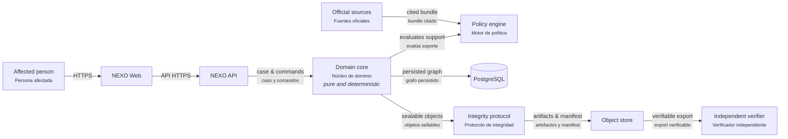

# NEXO

**A verifiable digital-rights case graph.**

NEXO helps a person turn scattered digital incident material into an inspectable case: original artifacts, direct observations, user assertions, reproducible derived facts, bounded inferences, versioned legal claims, and action options. It is not a legal-answer generator. Every visible action must be able to answer: **why is this shown to me?**

```text
ActionOption
  ├─ factual support → provenance → artifact / user assertion
  └─ legal support   → NormativeClaim → NormativeSource → captured bytes
```

An honest negative result is typed too: a stale policy requires its bundle and
freshness evidence; an out-of-jurisdiction result requires scope evidence; an
abstention carries its precise cause. NEXO never fakes an `ActionOption` merely
to display that no action can be offered.

The first supported jurisdictions are Argentina and the United States. They will be independent policy bundles implementing a shared domain contract; NEXO does not flatten distinct legal systems into one generic rule set.

NEXO distinguishes normative authority from acquisition: a statute from an
official issuer remains primary even if acquired through a web fetch. It also
distinguishes a rights route from the materials used to pursue it: NEXO may
prepare a request, evidence package, or export, but it never silently performs
the external legal act.

## Core principles

- **Evidence is not inference.** An extracted email date, a user declaration, and a model hypothesis remain different kinds of claim.
- **The model narrates; it has no authority.** It may produce a replaceable explanation from an authorized graph projection. It cannot add support, change an action state, or invent a right.
- **Unsupported actions fail closed.** A missing mandatory requirement cannot become `AVAILABLE`.
- **Integrity has a purpose.** Original artifacts, manifests, exports, policy bundles, and selected audit events are sealed when identity or historical alteration matters. Generated prose is not made authoritative by hashing it.
- **A verifier is independent.** The future verification CLI must not import the application server or require its database.

## Architecture

The architecture diagram is available in [`docs/architecture/nexo-architecture.html`](docs/architecture/nexo-architecture.html); its editable source is [`docs/architecture/nexo-architecture.json`](docs/architecture/nexo-architecture.json). It is also published live at [annatchijova.github.io/nexo/docs/architecture/nexo-architecture.html](https://annatchijova.github.io/nexo/docs/architecture/nexo-architecture.html).



The planned boundary is Rust for the domain, policy, integrity protocol, API, and independent verifier; TypeScript is deliberately limited to the web experience.

1. Protocol foundation — typed identifiers, canonical serialization, explicit versions.
2. Evidence graph — artifacts, observations, assertions, derived facts, and inferences.
3. Policy engine — source-backed normative claims and jurisdictional evaluation.
4. Application layer — commands, transactions, authorization, persistence, and exports.
5. Interface and narration — explanation of already-authorized support, never decision-making.

See [`docs/ARCHITECTURE.md`](docs/ARCHITECTURE.md) and [`docs/SECURITY_MODEL.md`](docs/SECURITY_MODEL.md).

## Development method

NEXO is built one closed layer at a time:

```text
contract → implementation → adversarial tests → red-team review → next layer
```

There is no “happy-path-only” milestone. Each layer must state its threat model, fail-closed behavior, hostile-input tests, and known limits before the next layer begins. The operating procedure is in [`docs/DEVELOPMENT_CYCLE.md`](docs/DEVELOPMENT_CYCLE.md).

## Status

Stage 0: architecture, integrity boundaries, sandbox boundary, and development protocol are established. No legal policy claim or legal guidance is implemented yet.

## License

Apache License 2.0. See [`LICENSE`](LICENSE).
