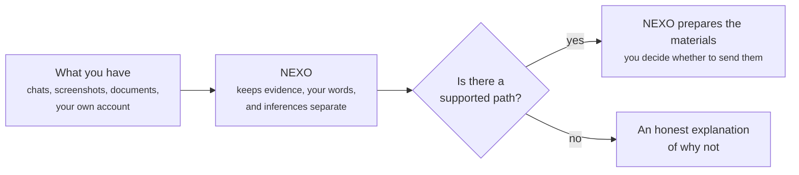

<p align="center">
  
</p>

# NEXO

**[English](README.md) · [Español](README_ES.md) · [Technical README](docs/TECHNICAL_README.md) · [Install](INSTALL.md)**

**Built for LexHack 2026 — Access to Justice & Civic Tech, and Digital Rights & Policy Tech.**

**Turn what happened to you into something you can actually show someone.**

<p align="center">
  
</p>

## The night this started mattering

Picture the moment right after it happens. Someone posted something of
yours without asking. Or a company that was supposed to protect your data
didn't. You're not thinking about statutes or hash functions — you're
scrolling back through a chat, trying to screenshot everything before it
disappears, wondering if any of this "counts," and dreading the first
sentence you'll have to say out loud to a lawyer, a friend, or a police
officer.

That moment — scared, alone, staring at a phone full of scattered proof —
is the one NEXO was built for. Not the tidy case study version. The real
one, at 2 a.m., where you don't know what you have or whether it's enough.

## What NEXO actually does for you

You hand NEXO what you have — a message, an email, a PDF, your own words
about what happened — and it never mixes them up. It always keeps three
things separate and clearly labeled:

- what you **have** (the evidence, exactly as it exists),
- what you **said** (your own account, respected as your account),
- what NEXO **concludes** (a narrow, honest inference — never a verdict).

If there isn't enough yet, NEXO doesn't pretend. It tells you precisely
what's missing, so your next step is clear instead of paralyzing. And when
there *is* a supported path, it shows you the actual law behind it and can
prepare the paperwork — a request, an evidence package, an export — for
you to send. **NEXO prepares. It never files or sends anything on its
own.** That's not a promise in a privacy policy somewhere; it's how the
software is built.


```mermaid
flowchart LR
    input["What you have<br/><small>chats, screenshots, documents,<br/>your own account</small>"] --> nexo["NEXO<br/><small>keeps evidence, your words,<br/>and inferences separate</small>"]
    nexo --> question{"Is there a<br/>supported path?"}
    question -->|"yes"| prep["NEXO prepares the materials<br/><small>you decide whether to send them</small>"]
    question -->|"no"| honest["An honest explanation<br/>of why not"]
```

<p align="center">
  
</p>

## What NEXO refuses to be

It refuses to be another tool that sounds confident and isn't. It is not a
lawyer, not legal advice, and not a chatbot improvising from a general
sense of "the law." It only speaks from real statutes it can cite, one
jurisdiction at a time — Argentina today, with the United States planned
as a second, independently-built bundle rather than a shortcut.

|  | A typical "know your rights" tool | NEXO |
|---|---|---|
| Evidence vs. your account vs. its own conclusion | Usually blurred into one confident-sounding story | Kept as three distinct, separately labeled kinds of claim |
| When nothing applies | Shows a generic result anyway, or just goes blank | An honest negative result, with its precise cause, is a first-class outcome |
| Legal basis | Paraphrased or generic | Cites the actual captured statute text behind each claim |
| Filing the action | Sometimes implied or automated | Never — NEXO prepares materials, you send them |

<p align="center">
  
</p>

## Why the receipts matter

You shouldn't have to just trust a piece of software with something this
personal. So you don't have to. Every artifact you add, every case you
export, and the exact legal bundle used to evaluate it gets a
**SHA-256 fingerprint** — a unique signature of those exact bytes. Change
one byte, and the fingerprint changes with it.

That's what lets a lawyer, a platform, or a court check your export
themselves instead of taking NEXO's word for it — with a small, standalone
verifier that doesn't need NEXO's own server running. What you exported
stays checkable even if NEXO, the company, the project, disappears
tomorrow. It's a tamper-evident seal: not a promise nothing can go wrong,
but a guarantee that if something did, it would show.

## How it's put together

```text
nexo/
├── crates/
│   ├── nexo-core/                        # pure domain model: evidence graph, policy types, no I/O
│   ├── nexo-policy-ar/                   # Argentina: Ley 25.326 (personal data access) bundle
│   ├── nexo-policy-ar-digital-violence/  # Argentina: Ley 27.736 (digital violence) bundle
│   ├── nexo-policy-bridge/               # jurisdiction / bundle selection
│   ├── nexo-app/                         # transactions, PostgreSQL persistence, authorization
│   ├── nexo-api/                         # HTTP API — the only network-facing surface
│   ├── nexo-integrity/                   # hashing, canonical serialization, audit chain
│   ├── nexo-verifier/                    # standalone export verifier — no server, no database
│   ├── nexo-sandbox/                     # isolated evidence-extraction worker
│   ├── nexo-extraction/                  # extractor interface
│   ├── nexo-extractor-plaintext/         # plain-text extractor
│   ├── nexo-extractor-eml/               # email (.eml) extractor
│   ├── nexo-extractor-pdf/               # PDF text extractor
│   └── nexo-report/                      # Markdown/HTML/PDF report rendering
├── web/                                  # TypeScript web client
├── docs/                                 # contracts, architecture, red-team rounds, ADRs
├── deploy/aws/                           # personal-deployment preparation
└── scripts/                              # test and schema helpers
```

<p align="center">
  
</p>

## This isn't a mockup

Argentina has two real, wired policy bundles — Ley 25.326 (personal data
access, rectification, and suppression) and Ley 27.736 (digital violence) —
each built from captured official legal text, not a paraphrase someone
typed from memory. The backend covers the whole path: evidence in,
evaluation, report, preparation, export — and that path was confirmed by
actually running the test suite against a live PostgreSQL database, not
just by reading the code and hoping.

The full test evidence, the architecture, and the honest list of what's
still a gap live in the [Technical README](docs/TECHNICAL_README.md) — a
project that talks about people's rights doesn't get to bury its own
limitations in a footnote. One gap worth naming here, not just there:
today, getting access to a real workspace means someone with server
access hands you a token by hand — there's no self-serve onboarding yet.
That's exactly why the DEMO below needs nothing from anyone.

## Try it — no account, no risk

The demo is at [nexo-web-sigma.vercel.app/demo](https://nexo-web-sigma.vercel.app/demo).
No token, nothing to sign up for, nothing real is sent anywhere. Walk
through a personal-data case or a digital-violence case exactly the way a
real person would, end to end, and see the `.eml`, the PDF, and the
SHA-256 manifest it generates. The full interface is live at
[nexo-web-sigma.vercel.app](https://nexo-web-sigma.vercel.app); creating a
real case needs a running backend behind it — see the
[Technical README](docs/TECHNICAL_README.md) for what that takes.

<p align="center">
  
</p>

<p align="center">
  
</p>

---

## License

Apache License 2.0. See [`LICENSE`](LICENSE).
