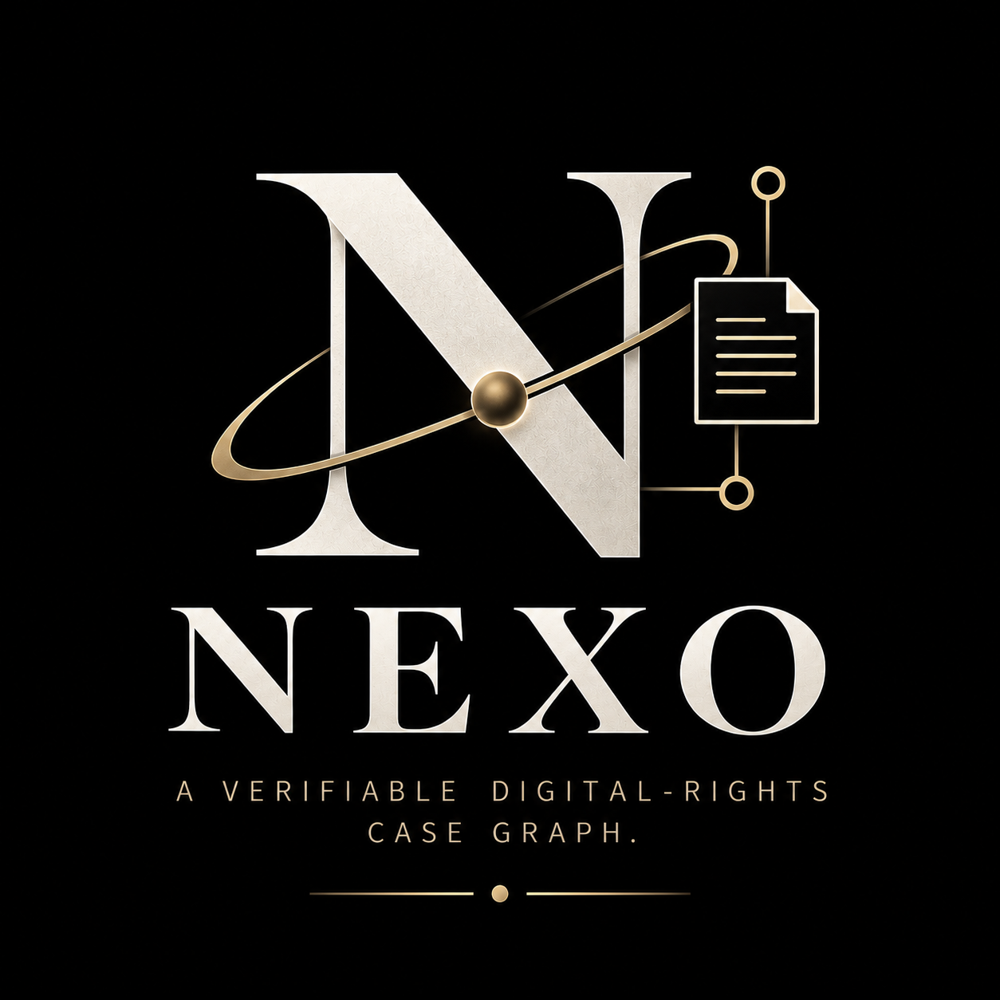
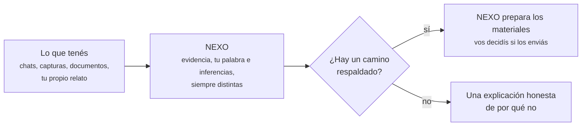

<p align="center">
  
</p>

# NEXO

**[English](README.md) · [Español](README_ES.md) · [Technical README](docs/TECHNICAL_README.md)**

**Convertí lo que te pasó en algo que de verdad podés mostrarle a alguien.**

Si a alguien le está pasando una situación de violencia digital, una
violación de privacidad, u otra situación que afecta sus derechos, lo
difícil casi nunca es "qué pasó" — es convertir capturas de pantalla
sueltas, chats y recuerdos en algo que una persona, una plataforma o una
autoridad tome en serio.

## Qué es NEXO

Le das a NEXO lo que tenés — mensajes, documentos, tu propio relato de los
hechos — y NEXO mantiene cada pieza etiquetada con honestidad: lo que
*tenés* (evidencia), lo que *dijiste* (tu declaración), y lo que NEXO
*concluye* (una inferencia acotada). Nunca mezcla esas categorías, y nunca
inventa un derecho que no tenés. Si la respuesta es "todavía no hay
suficiente para esto", NEXO dice exactamente eso, en vez de simular una
respuesta.

Cuando sí hay un camino respaldado, NEXO te muestra por qué, citando la ley
real detrás — y puede preparar los materiales (un pedido, un paquete de
evidencia, una exportación) para que vos los envíes. **NEXO prepara. Nunca
presenta ni envía nada por su cuenta** — esa línea importa, y está
construida en el software, no solo prometida por escrito.



## Qué no es

NEXO no es un abogado, no es asesoramiento legal, y no es un chatbot que
contesta preguntas desde una noción general del derecho. Está acotado, una
jurisdicción a la vez, a estatutos reales que puede citar — hoy, Argentina;
Estados Unidos está planeado como un segundo bundle independiente.

|  | Una herramienta típica de "conocé tus derechos" | NEXO |
|---|---|---|
| Evidencia vs. tu relato vs. su propia conclusión | Generalmente mezclado en una sola narrativa | Se mantienen como tres tipos de afirmación distintos, etiquetados por separado |
| Cuando nada aplica | Muestra un resultado genérico igual, o queda en blanco | Un resultado negativo honesto, con su causa precisa, es un resultado de primera clase |
| Base legal | Parafraseada o genérica | Cita el texto real del estatuto capturado detrás de cada afirmación |
| Presentar la acción | A veces implícito o automatizado | Nunca — NEXO prepara materiales, vos los enviás |

## Cómo funciona, en términos generales

Un caso es un grafo: artefactos que aportás, observaciones directas
extraídas de ellos, tus propias declaraciones, y los hechos e inferencias
derivados de eso — cada uno se mantiene distinto. Ese grafo se evalúa contra
el bundle de política de una jurisdicción (un conjunto de reglas legales
versionado y citado a su fuente), que decide si hay una acción disponible,
y por qué. Todo lo que importa — artefactos, exportaciones, el bundle de
política vigente — se puede hashear y verificar de forma independiente, así
un resultado no tiene que tomarse por fe.

### No tenés que confiar en la palabra de NEXO

Cada pieza de evidencia que agregás, cada caso que exportás, y el bundle
legal exacto usado para evaluarlo, recibe una **huella SHA-256** — una firma
digital única de esos bytes exactos. Si cambia un solo byte, la huella
cambia con él. Eso es lo que permite:

- Probar que un documento que exportaste de NEXO no fue alterado desde que
  lo tenés.
- Que un abogado, una plataforma o un juzgado pueda verificar esa huella
  por su cuenta, en vez de confiar en la palabra de NEXO.
- Verificar todo esto con una herramienta chica e independiente, que no
  necesita el servidor ni la base de datos de NEXO corriendo — así lo que
  exportaste se puede seguir verificando aunque NEXO deje de existir.

Es la misma idea que un precinto a prueba de manipulación: no es la promesa
de que nada puede salir mal, sino la garantía de que si algo saliera mal,
se notaría.

```text
nexo/
├── crates/
│   ├── nexo-core/                        # modelo de dominio puro: grafo de evidencia, tipos de política, sin I/O
│   ├── nexo-policy-ar/                   # Argentina: bundle de Ley 25.326 (acceso a datos personales)
│   ├── nexo-policy-ar-digital-violence/  # Argentina: bundle de Ley 27.736 (violencia digital)
│   ├── nexo-policy-bridge/               # selección de jurisdicción / bundle
│   ├── nexo-app/                         # transacciones, persistencia en PostgreSQL, autorización
│   ├── nexo-api/                         # API HTTP — la única superficie expuesta a la red
│   ├── nexo-integrity/                   # hashing, serialización canónica, cadena de auditoría
│   ├── nexo-verifier/                    # verificador de exportaciones independiente — sin server, sin base de datos
│   ├── nexo-sandbox/                     # worker aislado de extracción de evidencia
│   ├── nexo-extraction/                  # interfaz de extractores
│   ├── nexo-extractor-plaintext/         # extractor de texto plano
│   ├── nexo-extractor-eml/               # extractor de email (.eml)
│   ├── nexo-extractor-pdf/               # extractor de texto de PDF
│   └── nexo-report/                      # generación de reportes en Markdown/HTML/PDF
├── web/                                  # cliente web en TypeScript
├── docs/                                 # contratos, arquitectura, rondas de red-team, ADRs
├── deploy/aws/                           # preparación del deployment personal
└── scripts/                              # scripts de test y de schema
```

## Evidencia de que esto funciona hoy

Argentina tiene dos bundles de política reales y wireados — Ley 25.326
(acceso, rectificación y supresión de datos personales) y Ley 27.736
(violencia digital) — ambos construidos a partir del texto legal realmente
capturado, no una paráfrasis. El backend cubre el camino completo
(evidencia, evaluación, informe, preparación, exportación), y eso se
verificó corriendo de verdad la suite de tests, incluso contra una base de
datos PostgreSQL real, no solo leyendo el código.

Toda la evidencia de los tests, la arquitectura, y la lista honesta de qué
falta todavía están en el [readme técnico](docs/TECHNICAL_README.md) — este
proyecto declara sus limitaciones en un documento dedicado en vez de
esconderlas en letra chica.

## Probalo

La demo está en [nexo-web-sigma.vercel.app](https://nexo-web-sigma.vercel.app).
La interfaz está viva, pero necesita un backend corriendo (API + base de
datos) detrás para poder crear un caso de verdad — mirá el
[readme técnico](docs/TECHNICAL_README.md) para saber qué hace falta.

---

## Licencia

Apache License 2.0. Ver [`LICENSE`](LICENSE).
