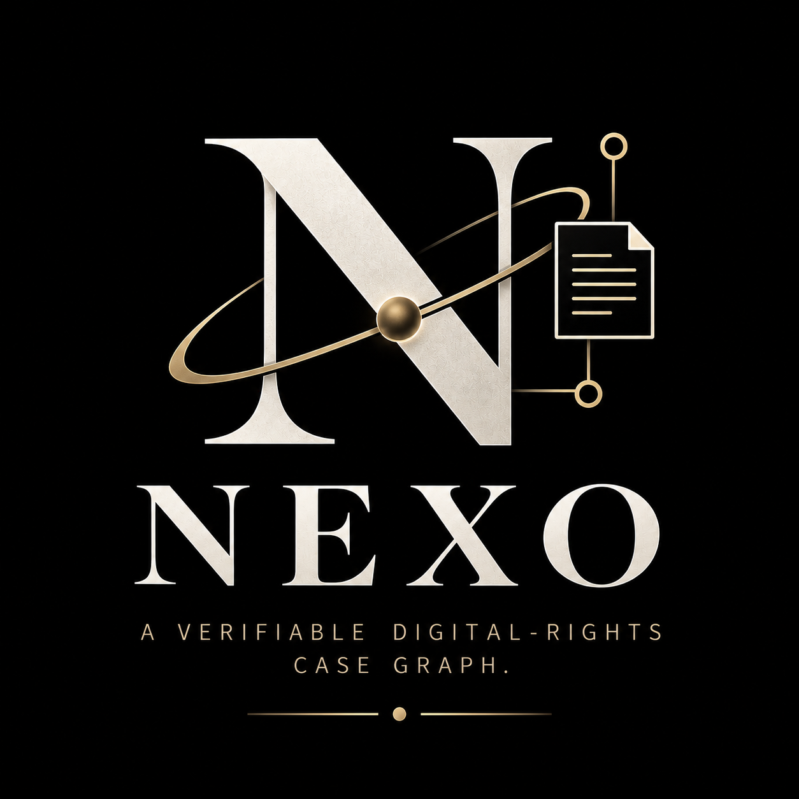
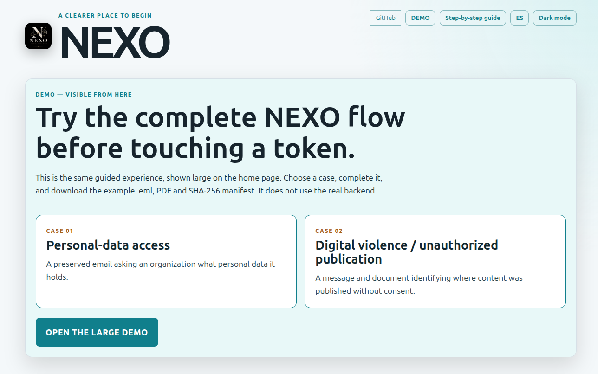
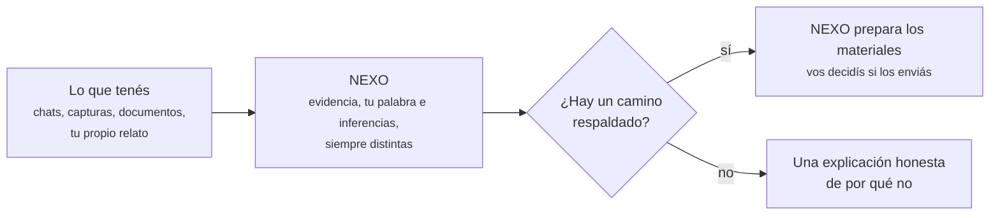
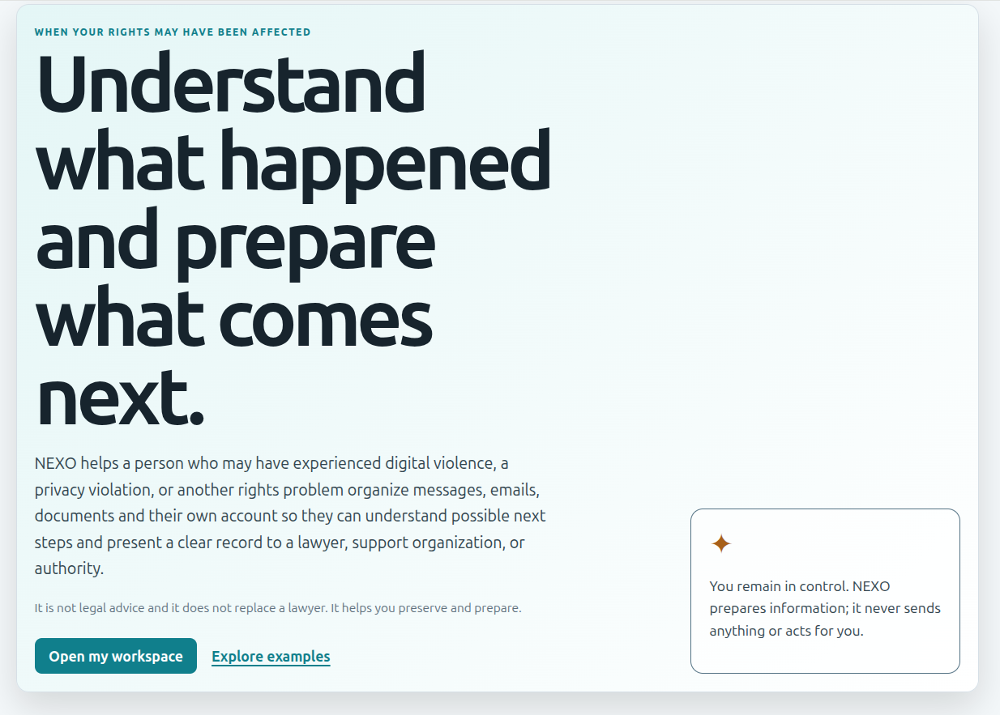
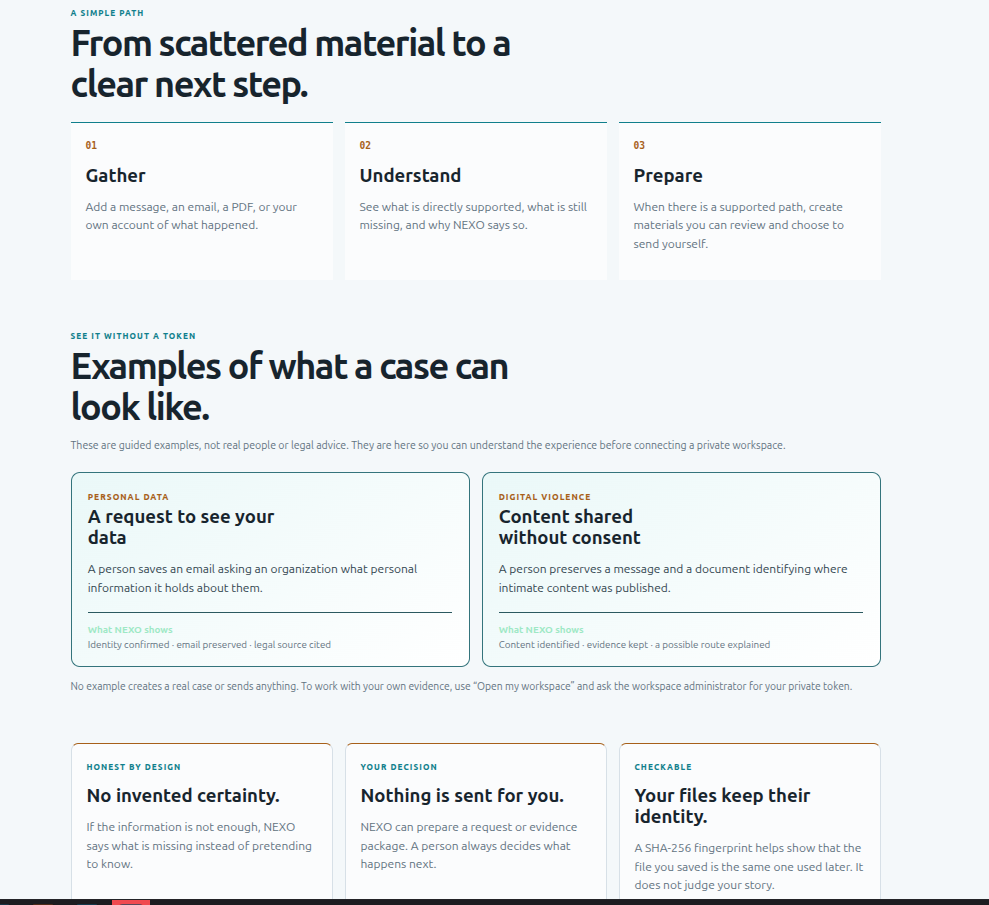
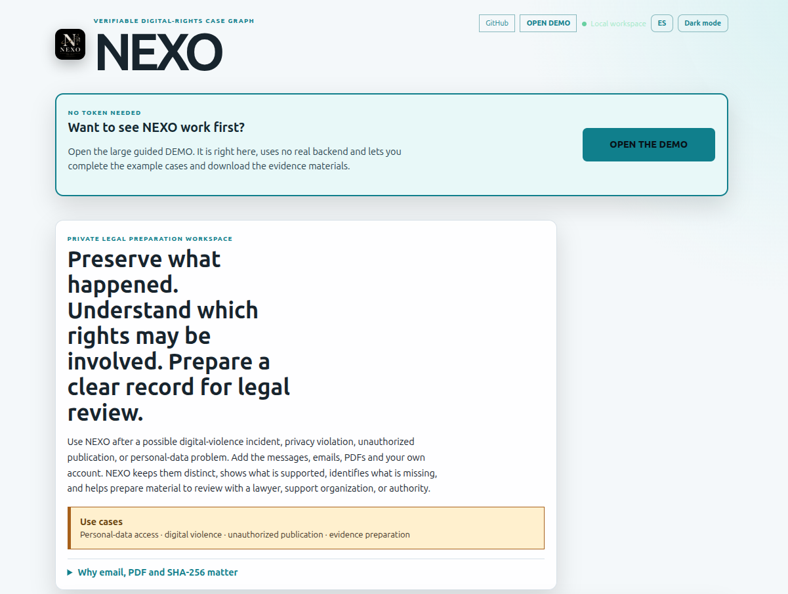
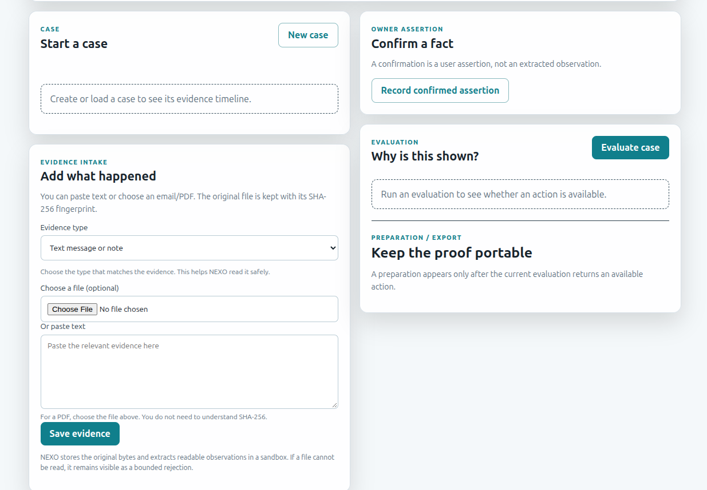
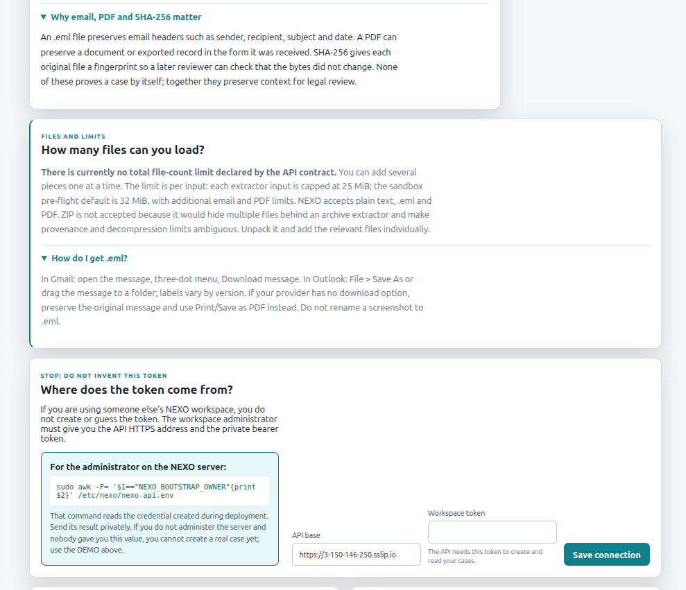

<p align="center">
  
</p>

# NEXO

**[English](README.md) · [Español](README_ES.md) · [Technical README](docs/TECHNICAL_README.md) · [Instalación](INSTALL.es.md)**

**Hecho para LexHack 2026 — Access to Justice & Civic Tech, y Digital Rights & Policy Tech.**

**Convertí lo que te pasó en algo que de verdad le podés mostrar a alguien.**

<p align="center">
  
</p>

## La noche en la que esto empezó a importar

Imaginate el momento justo después de que pasa. Alguien publicó algo tuyo
sin permiso. O una empresa que tenía que cuidar tus datos, no lo hizo. No
estás pensando en artículos de ley ni en funciones hash — estás
scrolleando un chat tratando de sacar captura de todo antes de que
desaparezca, preguntándote si algo de esto "cuenta", con miedo a la primera
frase que vas a tener que decir en voz alta frente a un abogado, una
amiga o un policía.

Ese momento — con miedo, sola con el teléfono lleno de pruebas sueltas —
es exactamente para el que se construyó NEXO. No la versión prolija de
caso de estudio. La real, a las dos de la mañana, cuando no sabés bien qué
tenés ni si alcanza.

## Qué hace NEXO, en concreto, por vos

Le das a NEXO lo que tenés — un mensaje, un correo, un PDF, tu propio
relato de lo que pasó — y NEXO nunca lo mezcla. Siempre mantiene tres
cosas separadas y etiquetadas con claridad:

- lo que **tenés** (la evidencia, tal cual existe),
- lo que **dijiste** (tu relato, respetado como tu relato),
- lo que NEXO **concluye** (una inferencia acotada y honesta — nunca un
  veredicto).

Si todavía no alcanza, NEXO no lo disimula. Te dice con precisión qué
falta, para que tu próximo paso sea claro y no paralizante. Y cuando sí
hay un camino respaldado, te muestra la ley real detrás — y puede preparar
los papeles (un pedido, un paquete de evidencia, una exportación) para que
vos los envíes. **NEXO prepara. Nunca presenta ni envía nada por su
cuenta.** Eso no es una promesa perdida en una política de privacidad: es
así como está construido el software.


```mermaid
flowchart LR
    input["Lo que tenés<br/><small>chats, capturas, documentos,<br/>tu propio relato</small>"] --> nexo["NEXO<br/><small>evidencia, tu palabra e inferencias,<br/>siempre distintas</small>"]
    nexo --> question{"¿Hay un camino<br/>respaldado?"}
    question -->|"sí"| prep["NEXO prepara los materiales<br/><small>vos decidís si los enviás</small>"]
    question -->|"no"| honest["Una explicación honesta<br/>de por qué no"]
```

<p align="center">
  
</p>

## Lo que NEXO se niega a ser

Se niega a ser otra herramienta que suena segura de sí misma sin serlo. No
es un abogado, no es asesoramiento legal, y no es un chatbot que improvisa
desde una noción general de "la ley". Solo habla desde estatutos reales
que puede citar, una jurisdicción a la vez — hoy, Argentina; Estados
Unidos está planeado como un segundo bundle construido de forma
independiente, no como un atajo.

|  | Una herramienta típica de "conocé tus derechos" | NEXO |
|---|---|---|
| Evidencia vs. tu relato vs. su propia conclusión | Generalmente mezclado en un relato que suena convincente | Se mantienen como tres tipos de afirmación distintos, etiquetados por separado |
| Cuando nada aplica | Muestra un resultado genérico igual, o queda en blanco | Un resultado negativo honesto, con su causa precisa, es un resultado de primera clase |
| Base legal | Parafraseada o genérica | Cita el texto real del estatuto capturado detrás de cada afirmación |
| Presentar la acción | A veces implícito o automatizado | Nunca — NEXO prepara materiales, vos los enviás |

<p align="center">
  
</p>

## Por qué importa que quede constancia

No deberías tener que confiar a ciegas en un software con algo tan
personal. Así que no hace falta. Cada evidencia que agregás, cada caso que
exportás, y el bundle legal exacto usado para evaluarlo, recibe una
**huella SHA-256** — una firma única de esos bytes exactos. Si cambia un
solo byte, la huella cambia con él.

Eso es lo que le permite a un abogado, una plataforma o un juzgado
verificar tu exportación por su cuenta, en vez de confiar en la palabra de
NEXO — con una herramienta chica e independiente que no necesita el
servidor de NEXO corriendo. Lo que exportaste sigue siendo verificable
incluso si NEXO, el proyecto, deja de existir mañana. Es la misma idea que
un precinto a prueba de manipulación: no es la promesa de que nada puede
salir mal, es la garantía de que si algo saliera mal, se notaría.

## Cómo está armado por dentro

```text
nexo/
├── crates/
│   ├── nexo-core/                        # modelo de dominio puro: grafo de evidencia, tipos de política, sin I/O
│   ├── nexo-policy-ar/                   # Argentina: bundle de Ley 25.326 (acceso a datos personales)
│   ├── nexo-policy-ar-digital-violence/  # Argentina: bundle de Ley 27.736 (violencia digital)
│   ├── nexo-policy-bridge/               # selección de jurisdicción / bundle
│   ├── nexo-app/                         # transacciones, persistencia en PostgreSQL, autorización
│   ├── nexo-api/                         # API HTTP — la única superficie expuesta a la red
│   ├── nexo-integrity/                   # hashing, serialización canónica, cadena de auditoría
│   ├── nexo-verifier/                    # verificador de exportaciones independiente — sin server, sin base de datos
│   ├── nexo-sandbox/                     # worker aislado de extracción de evidencia
│   ├── nexo-extraction/                  # interfaz de extractores
│   ├── nexo-extractor-plaintext/         # extractor de texto plano
│   ├── nexo-extractor-eml/               # extractor de email (.eml)
│   ├── nexo-extractor-pdf/               # extractor de texto de PDF
│   └── nexo-report/                      # generación de reportes en Markdown/HTML/PDF
├── web/                                  # cliente web en TypeScript
├── docs/                                 # contratos, arquitectura, rondas de red-team, ADRs
├── deploy/aws/                           # preparación del deployment personal
└── scripts/                              # scripts de test y de schema
```

<p align="center">
  
</p>

## Esto no es una maqueta

Argentina tiene dos bundles de política reales y ya conectados — Ley
25.326 (acceso, rectificación y supresión de datos personales) y Ley
27.736 (violencia digital) — ambos construidos a partir del texto legal
realmente capturado, no una paráfrasis escrita de memoria. El backend
cubre el camino completo: evidencia, evaluación, informe, preparación,
exportación — y eso se confirmó corriendo de verdad la suite de tests
contra una base de datos PostgreSQL real, no solo leyendo el código y
esperando que funcione.

Toda la evidencia de los tests, la arquitectura, y la lista honesta de qué
falta todavía, están en el [readme técnico](docs/TECHNICAL_README.md) — un
proyecto que habla de los derechos de las personas no tiene derecho a
esconder sus propias limitaciones en letra chica. Una que vale nombrar acá
y no solo allá: hoy, para acceder a un espacio real, alguien con acceso al
servidor te tiene que entregar un token a mano — todavía no hay una forma
de sumarte sola. Por eso la DEMO de abajo no te pide nada de eso.

## Mirá el video

[Video demo (2:57)](https://www.youtube.com/watch?v=9FJ-8g5eZz4)

**Please select 1080p quality when watching the video for the best
viewing experience.**

## Probalo — sin cuenta, sin riesgo

La demo está en [nexo-web-sigma.vercel.app/demo](https://nexo-web-sigma.vercel.app/demo).
Sin token, sin registrarte, sin que nada real se envíe a ningún lado.
Recorré un caso de datos personales o uno de violencia digital tal como lo
haría una persona real, de punta a punta, y mirá el `.eml`, el PDF y el
manifiesto SHA-256 que genera. La interfaz completa está viva en
[nexo-web-sigma.vercel.app](https://nexo-web-sigma.vercel.app); crear un
caso real necesita un backend corriendo detrás — mirá el
[readme técnico](docs/TECHNICAL_README.md) para saber qué hace falta.

<p align="center">
  
</p>

<p align="center">
  
</p>

---

## Licencia

Apache License 2.0. Ver [`LICENSE`](LICENSE).
