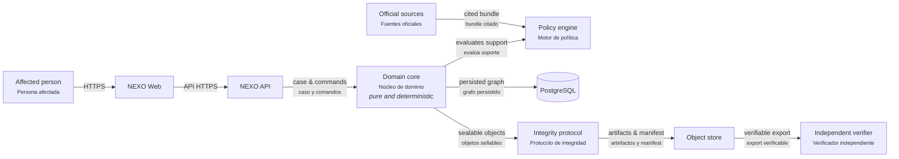

# NEXO — technical reference

This is the engineering-facing counterpart to the [root README](../README.md).
It states the architecture, the contracts, and the current implementation
status in precise, source-linked terms — the document to read before touching
code, not before deciding whether to try the product.

**A verifiable digital-rights case graph.**

NEXO helps a person turn scattered digital incident material into an inspectable case: original artifacts, direct observations, user assertions, reproducible derived facts, bounded inferences, versioned legal claims, and action options. It is not a legal-answer generator. Every visible action must be able to answer: **why is this shown to me?**

```text
ActionOption
  ├─ factual support → provenance → artifact / user assertion
  └─ legal support   → NormativeClaim → NormativeSource → captured bytes
```

An honest negative result is typed too: a stale policy requires its bundle and
freshness evidence; an out-of-jurisdiction result requires scope evidence; an
abstention carries its precise cause. NEXO never fakes an `ActionOption` merely
to display that no action can be offered.

Argentina is the first jurisdiction with real, wired policy bundles: Ley 25.326 (personal data access, rectification, and suppression) and Ley 27.736 (digital violence), each built from captured official sources per [`POLICY_BUNDLE_CONTRACT.md`](POLICY_BUNDLE_CONTRACT.md). The United States is planned as an independent bundle implementing the same domain contract once the Argentina bundles have been through a full red-team pass — NEXO does not flatten distinct legal systems into one generic rule set.

NEXO distinguishes normative authority from acquisition: a statute from an
official issuer remains primary even if acquired through a web fetch. It also
distinguishes a rights route from the materials used to pursue it: NEXO may
prepare a request, evidence package, or export, but it never silently performs
the external legal act.

## Core principles

- **Evidence is not inference.** An extracted email date, a user declaration, and a system interpretation remain different kinds of claim.
- **Explanations are deterministic projections.** NEXO has no model component. An explanation is deterministic citation rendering from an authorized graph projection: replaceable, regenerable, and unable to add support, change an action state, or invent a right.
- **Unsupported actions fail closed.** A missing mandatory requirement cannot become `AVAILABLE`.
- **Negative results are relational.** `ConflictingLegalClaims` and `Contraindicated` cannot be constructed through vector-only inputs; every supported path carries a typed witness produced by the policy engine.
- **Integrity has a purpose.** Original artifacts, manifests, exports, policy bundles, and selected audit events are sealed when identity or historical alteration matters. Deterministic explanation text is not made authoritative by hashing it.
- **A verifier is independent.** The future verification CLI must not import the application server or require its database.

## Architecture

The architecture diagram is available in [`architecture/nexo-architecture.html`](architecture/nexo-architecture.html); its editable source is [`architecture/nexo-architecture.json`](architecture/nexo-architecture.json). It is also published live at [annatchijova.github.io/nexo/docs/architecture/nexo-architecture.html](https://annatchijova.github.io/nexo/docs/architecture/nexo-architecture.html).



The planned boundary is Rust for the domain, policy, integrity protocol, API, and independent verifier; TypeScript is deliberately limited to the web experience.

1. Protocol foundation — typed identifiers, canonical serialization, explicit versions.
2. Evidence graph — artifacts, observations, assertions, derived facts, and inferences.
3. Policy engine — source-backed normative claims, jurisdictional evaluation, and versioned rule-match records.
4. Application layer — commands, transactions, authorization, persistence, and exports.
5. Interface — deterministic explanation of already-authorized support, never decision-making.

See [`ARCHITECTURE.md`](ARCHITECTURE.md) and [`SECURITY_MODEL.md`](SECURITY_MODEL.md).

## Development method

NEXO is built one closed layer at a time:

```text
contract → implementation → adversarial tests → red-team review → next layer
```

There is no “happy-path-only” milestone. Each layer must state its threat model, fail-closed behavior, hostile-input tests, and known limits before the next layer begins. The operating procedure is in [`DEVELOPMENT_CYCLE.md`](DEVELOPMENT_CYCLE.md).

## Status

Every claim below is capped at the evidence actually obtained this session —
**RUNTIME-CONFIRMED** where a real command was executed, **CODE FACT** where
it is a direct read of the live source, and named as a gap otherwise. Nothing
here is asserted from memory of an earlier state.

Two Argentina policy bundles are implemented and wired end-to-end — Ley 25.326
(personal data access, rectification, and suppression) and Ley 27.736 (digital
violence) — each with real captured sources and both positive and honest-negative
evaluation paths (CODE FACT: [`POLICY_BUNDLE_AR_DATA_ACCESS_CONTRACT.md`](POLICY_BUNDLE_AR_DATA_ACCESS_CONTRACT.md),
[`POLICY_BUNDLE_AR_DIGITAL_VIOLENCE_CONTRACT.md`](POLICY_BUNDLE_AR_DIGITAL_VIOLENCE_CONTRACT.md);
`crates/nexo-policy-ar/src/lib.rs`, `crates/nexo-policy-ar-digital-violence/src/lib.rs`).
The HTTP API covers the full case lifecycle: credential issuance and
revocation, case creation, evidence intake, evaluation, Markdown/HTML/PDF
reports, preparation, and export (CODE FACT: `crates/nexo-api/src/lib.rs`
route table). The audit chain has gone through three iterations, the latest
adding an authenticated chain-state witness
([`AUDIT_CHAIN_V1_CONTRACT.md`](AUDIT_CHAIN_V1_CONTRACT.md),
[`AUDIT_CHAIN_V2_HMAC_CONTRACT.md`](AUDIT_CHAIN_V2_HMAC_CONTRACT.md)).
RUNTIME-CONFIRMED this session: `cargo test --workspace` passes with no
failures; `cargo clippy --workspace --all-targets` is clean; the
PostgreSQL-backed repository tests in
`crates/nexo-app/tests/repository_test.rs` pass against a live local database
via `scripts/test_schema.sh` and `scripts/test_repository.sh`. The
adversarial-review record through this point is in [`red-team/`](red-team/)
up to round 032.

Stated gaps, rather than left for a reader to discover: the sandboxed
extraction worker (`nexo-extraction`) currently ships only a plain-text
extractor — email (.eml), PDF, and image/OCR extraction are not built, so
evidence intake is limited to pasted or uploaded plain text today. The web UI
(`web/src/main.ts`) covers the evidence-to-citation-to-export flow, but as a
single dense page rather than the full case-timeline experience in
[`WEB_UI_CONTRACT.md`](WEB_UI_CONTRACT.md), and it has not had an
accessibility pass. Personal deployment is prepared
([`../deploy/aws/README.md`](../deploy/aws/README.md)) but not yet running as
a persisted, backed-up instance — this is a PLAUSIBLE HYPOTHESIS, not
RUNTIME-CONFIRMED: no live instance was reached this session. The United
States bundle has not been started. Argentina and United States policy
semantics remain bundle-specific; NEXO does not claim universal legal
correctness or provide legal advice.

There is also one uncommitted, unwired change on `main` as of this writing:
`ArtifactSummary` / `list_case_artifacts` in `crates/nexo-app/src/repository.rs`
has no caller anywhere in the workspace (CODE FACT, verified by grep). It
compiles and does not affect `cargo test`/`cargo clippy`, but it is not part
of any finished feature — flagged here rather than silently committed or
silently dropped.

### Web demo

The current frontend is published at [nexo-web-sigma.vercel.app](https://nexo-web-sigma.vercel.app).

- English is the default language; use the `ES`/`EN` buttons to switch the interface.
- Dark mode is the default; the theme button enables light mode.
- The interface stores the selected language, theme, API base, bearer token,
  and case id in browser local storage.
- Set `VITE_NEXO_API_BASE` in Vercel, or enter the API base in the UI, once
  the backend is deployed.

The Vercel project currently hosts the UI only. Case creation, evidence
ingestion, evaluation, preparation, export, artifact downloads, and hash
verification require the NEXO API, PostgreSQL, persistent object storage, and
the Docker extractor sandbox. The AWS deployment preparation is documented in
[`../deploy/aws/README.md`](../deploy/aws/README.md).

## License

Apache License 2.0. See [`../LICENSE`](../LICENSE).
