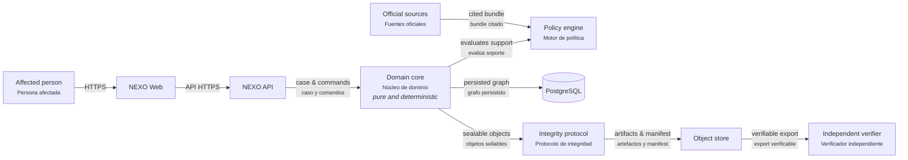

# NEXO — technical reference

This is the engineering-facing counterpart to the primary README
([English](../README.md) · [Español](../README_ES.md)). It states the
architecture, the contracts, the data model, the API surface, and the
current implementation status in precise, source-linked terms, without
softening for a general audience — the document to read before touching
code or auditing the project, not before deciding whether to try the
product.

**A verifiable digital-rights case graph.**

NEXO helps a person turn scattered digital incident material into an inspectable case: original artifacts, direct observations, user assertions, reproducible derived facts, bounded inferences, versioned legal claims, and action options. It is not a legal-answer generator. Every visible action must be able to answer: **why is this shown to me?**

```text
ActionOption
  ├─ factual support → provenance → artifact / user assertion
  └─ legal support   → NormativeClaim → NormativeSource → captured bytes
```

An honest negative result is typed too: a stale policy requires its bundle and
freshness evidence; an out-of-jurisdiction result requires scope evidence; an
abstention carries its precise cause. NEXO never fakes an `ActionOption` merely
to display that no action can be offered.

Argentina is the first jurisdiction with real, wired policy bundles: Ley 25.326 (personal data access, rectification, and suppression) and Ley 27.736 (digital violence), each built from captured official sources per [`POLICY_BUNDLE_CONTRACT.md`](POLICY_BUNDLE_CONTRACT.md). The United States is planned as an independent bundle implementing the same domain contract once the Argentina bundles have been through a full red-team pass — NEXO does not flatten distinct legal systems into one generic rule set.

NEXO distinguishes normative authority from acquisition: a statute from an
official issuer remains primary even if acquired through a web fetch. It also
distinguishes a rights route from the materials used to pursue it: NEXO may
prepare a request, evidence package, or export, but it never silently performs
the external legal act.

## Core principles

- **Evidence is not inference.** An extracted email date, a user declaration, and a system interpretation remain different kinds of claim.
- **Explanations are deterministic projections.** NEXO has no model component. An explanation is deterministic citation rendering from an authorized graph projection: replaceable, regenerable, and unable to add support, change an action state, or invent a right.
- **Unsupported actions fail closed.** A missing mandatory requirement cannot become `AVAILABLE`.
- **Negative results are relational.** `ConflictingLegalClaims` and `Contraindicated` cannot be constructed through vector-only inputs; every supported path carries a typed witness produced by the policy engine.
- **Integrity has a purpose.** Original artifacts, manifests, exports, policy bundles, and selected audit events are sealed when identity or historical alteration matters. Deterministic explanation text is not made authoritative by hashing it.
- **A verifier is independent.** The independent verifier CLI (`nexo-verifier`) must not import the application server or require its database.

## Architecture

The architecture diagram is available in [`architecture/nexo-architecture.html`](architecture/nexo-architecture.html); its editable source is [`architecture/nexo-architecture.json`](architecture/nexo-architecture.json). It is also published live at [annatchijova.github.io/nexo/docs/architecture/nexo-architecture.html](https://annatchijova.github.io/nexo/docs/architecture/nexo-architecture.html).



The boundary is Rust for the domain, policy, integrity protocol, API, and independent verifier; TypeScript is deliberately limited to the web experience.

1. Protocol foundation — typed identifiers, canonical serialization, explicit versions.
2. Evidence graph — artifacts, observations, assertions, derived facts, and inferences.
3. Policy engine — source-backed normative claims, jurisdictional evaluation, and versioned rule-match records.
4. Application layer — commands, transactions, authorization, persistence, and exports.
5. Interface — deterministic explanation of already-authorized support, never decision-making.

See [`ARCHITECTURE.md`](ARCHITECTURE.md) and [`SECURITY_MODEL.md`](SECURITY_MODEL.md).

## Repository tree

```text
nexo/
├── crates/
│   ├── nexo-core/                        # pure domain model: evidence graph, ActionEvaluation, negative-evidence types; no I/O
│   ├── nexo-policy-ar/                   # Argentina — Ley 25.326 (personal data access) bundle, captured sources
│   ├── nexo-policy-ar-digital-violence/  # Argentina — Ley 27.736 (digital violence) bundle, captured sources
│   ├── nexo-policy-bridge/               # jurisdiction / bundle selection boundary (docs/adr/0006)
│   ├── nexo-app/                         # transactions, PostgreSQL repository, authorization, export producer
│   ├── nexo-api/                         # HTTP API (axum router + handlers) — the only network-facing surface
│   ├── nexo-integrity/                   # canonical serialization, SHA-256 hashing, audit-chain primitives
│   ├── nexo-verifier/                    # standalone export verifier — no server, no database dependency
│   ├── nexo-sandbox/                     # isolated evidence-extraction worker boundary
│   ├── nexo-extraction/                  # extractor trait / typed extraction result
│   ├── nexo-extractor-plaintext/         # plain-text extractor — the only extractor shipped today
│   └── nexo-report/                      # Markdown/HTML/PDF report rendering
├── web/src/main.ts                       # TypeScript web client — single-page evidence/evaluation/export flow
├── docs/
│   ├── *_CONTRACT.md                     # one contract per layer (application, integrity, policy bundle, API, ...)
│   ├── adr/                              # architecture decision records
│   ├── red-team/                         # adversarial review rounds, one file per round
│   ├── architecture/                     # rendered + editable architecture diagram
│   ├── TECHNICAL_README.md               # this document
│   └── KNOWN_LIMITATIONS.md              # exhaustive, dedicated account of current gaps
├── deploy/aws/README.md                  # single-tenant AWS deployment preparation
└── scripts/                              # test_schema.sh, test_repository.sh, run_api.sh, build_extractors.sh
```

## Data model and persistence

PostgreSQL is the system of record for case graphs, digests, provenance,
ingestion metadata, normative sources and claims, policy bundles and their
activations, evaluations, evaluation receipts, preparations, credentials,
and the audit log. Original artifact bytes and export outputs live in a
content-addressed object store (local filesystem today, behind an interface
that also fits S3-compatible storage). The migration is
`crates/nexo-app/migrations/0001_init.sql`; `scripts/test_schema.sh` asserts
schema-level invariants (rejecting a preparation against a non-actionable
evaluation, cross-case node references, tool version zero) directly in SQL,
independent of the Rust repository layer.

## API surface

Routes exposed by `crates/nexo-api/src/lib.rs`, all under `/v1` except the
health check:

| Method | Path | Purpose |
|---|---|---|
| GET | `/healthz` | liveness |
| GET | `/bundles` | list active policy bundles |
| POST | `/credentials` | issue an owner credential |
| DELETE | `/credentials/current` | revoke the credential in use |
| POST | `/cases` | create a case |
| GET | `/cases/{case_id}` | read a case |
| POST | `/cases/{case_id}/evidence` | add evidence (routed through the sandbox) |
| POST | `/cases/{case_id}/assertions` | add a user assertion |
| POST | `/cases/{case_id}/evaluate` | request an evaluation |
| GET | `/cases/{case_id}/evaluations` | list evaluations |
| GET | `/cases/{case_id}/evaluations/{evaluation_id}/report` | download a report (MD/HTML/PDF) |
| POST | `/cases/{case_id}/preparations` | request a preparation — `kind: "draft_request"` (a human-readable request document) or `kind: "evidence_package"` (a self-verifying index of the case's artifacts, digests, and extractions) |
| GET | `/cases/{case_id}/preparations/{preparation_id}/export/manifest` | read an export manifest |
| POST | `/cases/{case_id}/preparations/{preparation_id}/export` | export a preparation |
| GET | `/cases/{case_id}/preparations/{preparation_id}/export/artifacts/{digest}` | read an exported artifact |

Full request/response contracts: [`API_CONTRACT.md`](API_CONTRACT.md).

## Design decisions

Non-obvious architectural choices are recorded as ADRs, with the rejected
alternative and why it was rejected, in [`adr/`](adr/) — for example, why
bundle selection is a distinct boundary (0006), why evaluations are pure and
side-effect-free (0008), and why negative evidence (`Contraindicated`,
`ConflictingLegalClaims`) is relational rather than vector-only (0009).

## Development method

NEXO is built one closed layer at a time:

```text
contract → implementation → adversarial tests → red-team review → next layer
```

There is no "happy-path-only" milestone. Each layer must state its threat model, fail-closed behavior, hostile-input tests, and known limits before the next layer begins. The operating procedure is in [`DEVELOPMENT_CYCLE.md`](DEVELOPMENT_CYCLE.md); the adversarial-review record is in [`red-team/`](red-team/), one file per round.

## Running the tests yourself

```sh
cargo test --workspace              # unit + integration tests across the workspace
cargo clippy --workspace --all-targets
scripts/test_schema.sh              # SQL-level invariants, requires a local PostgreSQL
scripts/test_repository.sh          # PostgreSQL-backed repository integration tests
```

## Status

Every claim below is capped at the evidence actually obtained this session —
**RUNTIME-CONFIRMED** where a real command was executed, **CODE FACT** where
it is a direct read of the live source, and named as a gap otherwise. Nothing
here is asserted from memory of an earlier state.

Two Argentina policy bundles are implemented and wired end-to-end — Ley 25.326
(personal data access, rectification, and suppression) and Ley 27.736 (digital
violence) — each with real captured sources and both positive and honest-negative
evaluation paths (CODE FACT: [`POLICY_BUNDLE_AR_DATA_ACCESS_CONTRACT.md`](POLICY_BUNDLE_AR_DATA_ACCESS_CONTRACT.md),
[`POLICY_BUNDLE_AR_DIGITAL_VIOLENCE_CONTRACT.md`](POLICY_BUNDLE_AR_DIGITAL_VIOLENCE_CONTRACT.md);
`crates/nexo-policy-ar/src/lib.rs`, `crates/nexo-policy-ar-digital-violence/src/lib.rs`).
The HTTP API covers the full case lifecycle: credential issuance and
revocation, case creation, evidence intake, evaluation, Markdown/HTML/PDF
reports, two preparation kinds (`draft_request`, `evidence_package`), and
export (CODE FACT: route table above, read from `crates/nexo-api/src/lib.rs`).
The audit chain has gone through three iterations, the latest adding an
authenticated chain-state witness
([`AUDIT_CHAIN_V1_CONTRACT.md`](AUDIT_CHAIN_V1_CONTRACT.md),
[`AUDIT_CHAIN_V2_HMAC_CONTRACT.md`](AUDIT_CHAIN_V2_HMAC_CONTRACT.md)).
RUNTIME-CONFIRMED this session: `cargo test --workspace` passes with no
failures; `cargo clippy --workspace --all-targets` is clean; the
PostgreSQL-backed repository tests in
`crates/nexo-app/tests/repository_test.rs` pass against a live local database
via `scripts/test_schema.sh` and `scripts/test_repository.sh`; the full
evidence-to-preparation-to-export path, including the `evidence_package` kind,
passes end-to-end against real Docker-sandboxed extraction via
`scripts/test_api.sh`. The adversarial-review record through this point is in
[`red-team/`](red-team/) up to round 032.

**The exhaustive, dedicated account of what is not yet built — the
extraction worker's format coverage, the web UI's scope, deployment status,
and the United States bundle — is in
[`KNOWN_LIMITATIONS.md`](KNOWN_LIMITATIONS.md)**, which also records what was
resolved this session (the `evidence_package` preparation, and a flaky
audit-export test fixed along the way). It is not summarized here a second
time; read it directly. Argentina and United States policy semantics remain
bundle-specific; NEXO does not claim universal legal correctness or provide
legal advice.

### Web demo

The current frontend is published at [nexo-web-sigma.vercel.app](https://nexo-web-sigma.vercel.app).

- English is the default language; use the `ES`/`EN` buttons to switch the interface.
- Dark mode is the default; the theme button enables light mode.
- The interface stores the selected language, theme, API base, bearer token,
  and case id in browser local storage.
- Set `VITE_NEXO_API_BASE` in Vercel, or enter the API base in the UI, once
  the backend is deployed.

The Vercel project currently hosts the UI only. Case creation, evidence
ingestion, evaluation, preparation, export, artifact downloads, and hash
verification require the NEXO API, PostgreSQL, persistent object storage, and
the Docker extractor sandbox. The AWS deployment preparation is documented in
[`../deploy/aws/README.md`](../deploy/aws/README.md).

## License

Apache License 2.0. See [`../LICENSE`](../LICENSE).
